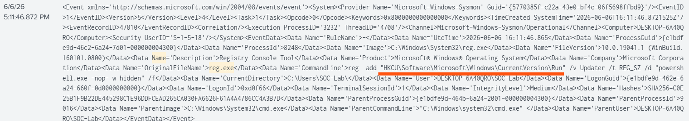
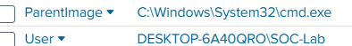
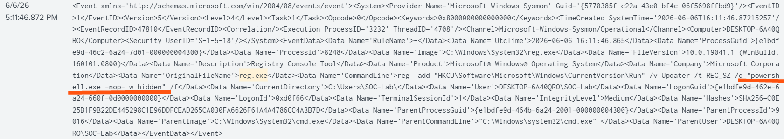
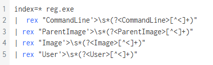

# SOC-01 Registry Persistence via Run Key

## Alert
Registry Persistence Detected

## MITRE ATT&CK Mapping

| Technique | ID |
|------------|------------|
| Registry Run Keys / Startup Folder | T1547.001 |
| PowerShell | T1059.001 |

## Indicators of Compromise

| Indicator | Value |
|------------|------------|
| Registry Path | HKCU\Software\Microsoft\Windows\CurrentVersion\Run |
| Registry Value | Updater |
| Parent Process | cmd.exe |
| Child Process | reg.exe |
| PowerShell Flag | -nop |
| PowerShell Flag | -w hidden |

## Evidence

### Registry Creation

### Parent Child Relationship

### PowerShell Evasion Flags

### SPL Query

