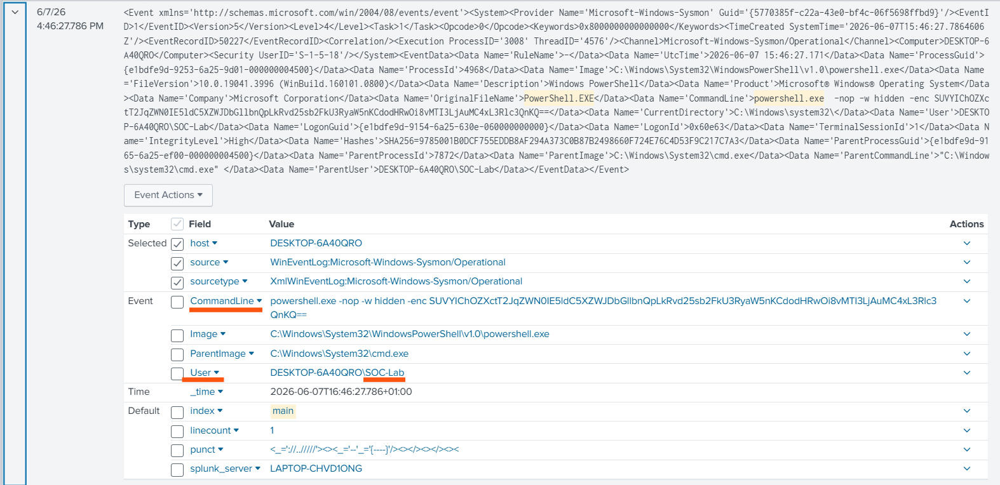
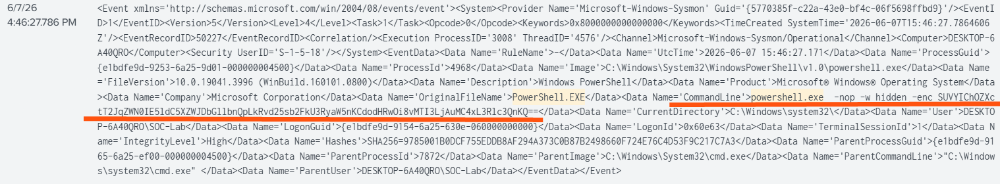
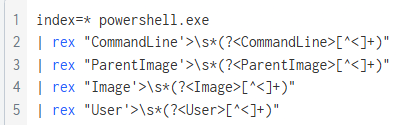

# SOC-02 Encoded PowerShell Execution

## Alert

Encoded PowerShell Execution Detected

## Investigation Summary

A PowerShell process was executed using multiple evasion flags including `-nop`, `-w hidden`, and `-enc`. The command was launched from `cmd.exe` and executed by the user `SOC-Lab`. The use of Base64 encoded commands and hidden execution indicates potential malicious activity and requires further investigation.

## MITRE ATT&CK Mapping

| Technique                                     | ID        |
| --------------------------------------------- | --------- |
| Command and Scripting Interpreter: PowerShell | T1059.001 |
| Obfuscated Files or Information               | T1027     |
| Hide Artifacts                                | T1564     |

## Indicators of Compromise

| Indicator       | Value          |
| --------------- | -------------- |
| Parent Process  | cmd.exe        |
| Child Process   | powershell.exe |
| PowerShell Flag | -nop           |
| PowerShell Flag | -w hidden      |
| PowerShell Flag | -enc           |
| User            | SOC-Lab        |

## Findings

* PowerShell was executed from cmd.exe.
* The command used the `-nop` flag to bypass PowerShell profiles.
* The command used the `-w hidden` flag to hide the PowerShell window from the user.
* The command used the `-enc` flag to execute a Base64 encoded command.
* The combination of these flags is commonly associated with attacker tradecraft and malware execution.

## Evidence

### Encoded PowerShell Execution

### Parent Child Relationship

### PowerShell Evasion Flags

### SPL Query

## Analyst Conclusion

The investigation identified PowerShell execution using multiple evasion and obfuscation techniques. The presence of `-nop`, `-w hidden`, and `-enc` increases the suspicion level and warrants additional review of the decoded command, associated processes, network activity, and persistence mechanisms. No further malicious activity was confirmed within the scope of this investigation.

